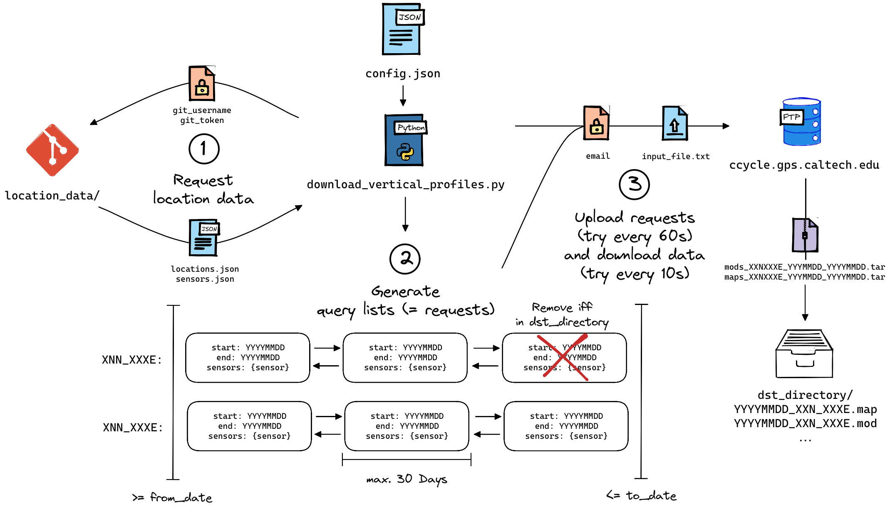

# Download Vertical Profiles

Used to download __`.map`__ and __`.mod`__ files from __<span>ccycle.gps.caltech.edu</span>__.[^1] [^2] <br /> Individual files contain vertical distributions of meteorological parameters for a certain location and date.

## Getting Started
Requires __Python 3.10+__. Dependency management with __Poetry__.[^3]

### :electric_plug: Installation

Clone the repository and set up the project interpreter
```bash
# Create a virtual environment
python3.10 -m venv .venv

# Activate virtual environment
source .venv/bin/activate

# Install dependencies
poetry install
```

### :gear: Configuration

Create a file `config/config.json` to configure your setup. An example `config.example.json` can be found in `config/`.

|       Name        | Type  |             Default             |                               Description                               |
| :---------------: | :---: | :-----------------------------: | :---------------------------------------------------------------------: |
|     `"email"`     |  str  |                -                |      Email granting access to <span>ccycle.gps.caltech.edu</span>       |
| `"location_data"` |  str  |                -                | GitHub **directory** containing `locations.json` and `sensors.json`[^4] |
| `"git_username"`  |  str  |                -                |                             GitHub username                             |
|   `"git_token"`   |  str  |                -                |                    GitHub personal access token[^5]                     |
|   `"from_date"`   |  str  |    `None` (= all past data)     |                     Start date in _YYYYMMDD_ format                     |
|    `"to_date"`    |  str  | Five days prior to current date |                      End date in _YYYYMMDD_ format                      |
| `"dst_directory"` |  str  |      `"vertical-profiles"`      |                            Output directory                             |


### 🚀 Operation

Run `download_vertical_profiles.py` manually

```bash
python download_vertical_profiles.py
```

**OR** configure a cron job schedule

```bash
crontab -e

# Add the following line
mm hh * * * .../.venv/bin/python .../download_vertical_profiles.py
```

## 🏛 Architecture
<a href="url"></a>
## 🗄 Structure
```
./
├── config/
│   └── config.example.json
├── docs/
│   └── architecture.drawio.svg
├── reports/
├── src/
│   ├── types/
│   │   ├── configuration.py
│   │   └── location.py
│   ├── utils/
│   │   └── network.py
│   └── query_list.py
├── vertical-profiles/
├── .gitattributes
├── .gitignore
├── README.md
├── download_vertical_profiles.py
├── poetry.lock
└── pyproject.toml
```

[^1]: CentralizedModMaker: https://tccon-wiki.caltech.edu/Main/CentralizedModMaker
[^2]: Predecessor: https://github.com/tum-esm/download-map-data.
[^3]: Poetry: https://python-poetry.org/docs/#installation
[^4]: Example Repository: https://github.com/tum-esm/em27-location-data
[^5]: GitHub Tokens:https://docs.github.com/en/authentication/keeping-your-account-and-data-secure/creating-a-personal-access-token
