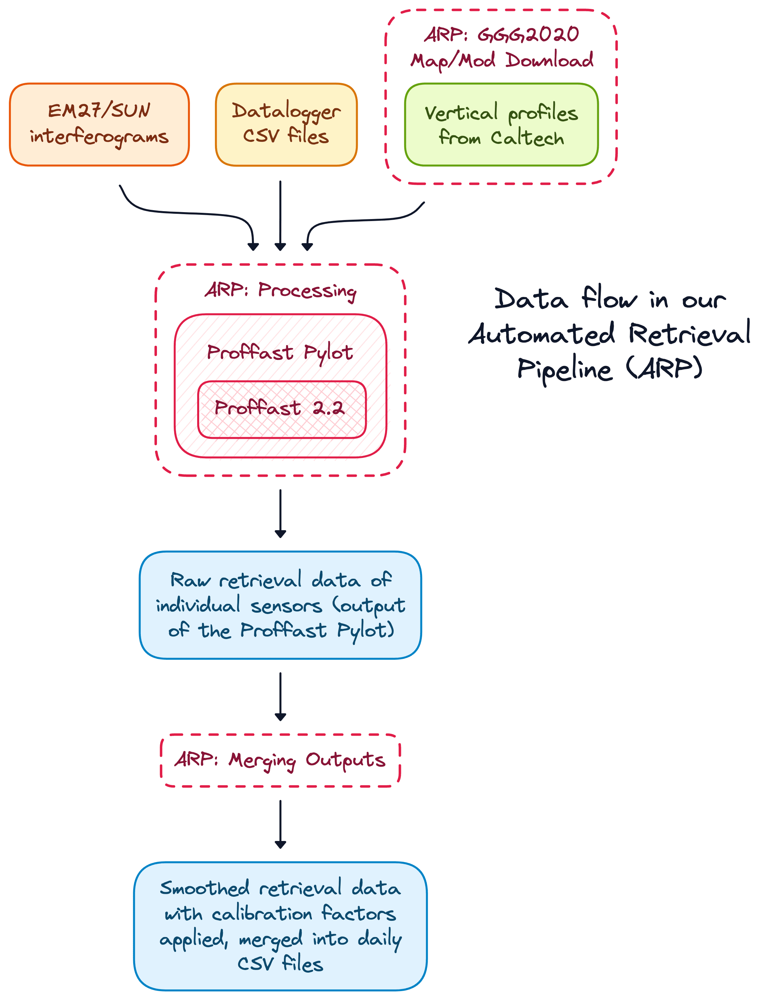

# Automated Retrieval Pipeline

**Work in progress. Until then, ask Moritz Makowski ([moritz.makowski@tum.de](mailto:moritz.makowski@tum.de))**

This codebase provides an automated data pipeline for Proffast 2.2 (https://www.imk-asf.kit.edu/english/3225.php). Under the hood, it uses the Proffast Pylot (https://gitlab.eudat.eu/coccon-kit/proffastpylot.git, Commit b9f5d7040dfeb8be5dba9c9a314fe7ab6dd98a9f) to interact with Proffast

We decided to included a copy of the Fortran codebase of Proffast as well as the Python codebase of the Proffast Pylot inside this repository, so we can slightly modify it and have less complexity due to Git Submodules or on-demand downloads.

<br/>

## Why to use this pipeline?

KIT already provides a tool to dispatch Proffast retrieval jobs, the Proffast Pylot (https://gitlab.eudat.eu/coccon-kit/proffastpylot.git). This pipeline wraps around the Pylot and uses the Pylot to interact with Proffast. It should not replace the Pylot but extend its capabilities in an opt-in style. You can build your own logic using the Pylot directly, or you can benefit from our experiences. We retrieve a lot of EM27 data due to operating MuccNet and use this pipeline since early 2022 (release date of Proffast 2.0).

The pipeline consists of three building blocks that are required to retrieve EM27 data:

| Task                                                                                      | Script Entrypoint                   |
| ----------------------------------------------------------------------------------------- | ----------------------------------- |
| 1. Downloading vertical profiles from the Caltech FTP server                              | `src/download_vertical_profiles.py` |
| 2. Running the Proffast Pylot to generate the averaged column concentrations              | `src/run_automated_proffast.py`     |
| 3. Postprocessing the individual station outputs and merging them into daily output files | `src/merge_retrieval_outputs.py`    |

<p align="center">
    
</p>

The Pylot codebase only provides the second part. In addition to task one and three, the pipeline provides:

-   **Easy configuration of using a validated `config.json` and `manual-queue.json`:** "validated" means that before the processing starts, the config files content will be parse and validated against a JSON schema. This way, you can be sure that the pipeline will not fail due to a misconfiguration and you will get precise error messages right away.
-   **Opinionated management of station metadata:** we are managing our EM27 metadata using JSONs opposed to in database tables. This has several benefits which we elaborate on in the metadata repository https://github.com/tum-esm/em27-metadata-template
-   **Filtering of interferogram files that Proffast cannot process:** with the plain Pylot, Proffast will fail for whole days of data even when only a few out of thousands of interferograms are corrupted. The pipeline will filter out these interferograms and only pass the valid ones to Proffast.
-   **Parallelization of the Proffast Pylot execution:** the Pylot already provides a parallelization, but the outputs of multiple days are merged and it can only process data of one station at a time. The pipeline will run the Pylot execution for each station and date individually inside a containerized environment and run a configurable number of containers in parallel.
-   **Write-protection of all input files during the containers execution:** the bigger the codebase that uses a file, the hard it is to verify that the input file is not modified during the execution. This is especially true for low-level code like Fortran. The pipeline will duplicate the datalogger files and the vertical profiles. Since there can be more that 10 Gb of interferograms per container, copying these is not that performance; hence we use symlinks to rename the files in a format the Pylot expects and the permissions of the original files will be set to read-only during a container's execution (and restored afterwards).
-   **Comprehensive management of logs and output data:** It will store both both failed and succeeded containers. The output is the same as with the Pylot, but also contains all config files the pipeline used to run this container and logs generated by the container.
-   **Merging of smoothed individual station outputs into daily output files:** this uses a Savitzky-Golay filter from the `SciPy` library with a windows size of 31 and a polyorder of 3. The output files container header sections that container everything needed to reproduce the output file based on the raw interferograms. See [Merged Outputs Files 👇](#merged-outputs-files) for more details.
-   **Documentation and full API reference:** hosted at https://tum-esm.github.io/automated-retrieval-pipeline/

<br/>

## Merged Outputs Files

In most cases, EM27 data becomes interesting, when multi sensor stations are deployed at different locations nearby to be used in a differential column approach (https://doi.org/10.5194/acp-16-8479-2016). For that, we have introduced the `campaigns.json` list where a set sensors with default locations each makes up a campaign (See https://github.com/tum-esm/em27-metadata-template).

For a campaign like this (in metadata repo):

```json
{
    "campaign_id": "muccnet",
    "from_date": "20190913",
    "to_date": "21000101",
    "stations": [
        { "sensor": "ma", "default_location": "TUM_I", "direction": "center" },
        { "sensor": "mb", "default_location": "FEL", "direction": "east" },
        { "sensor": "mc", "default_location": "GRAE", "direction": "west" }
    ]
}
```

... and an output merging target (in `config.json`) like this (the data types can be anything generated by the Pylot: `gnd_p`, `gnd_t`, `app_sza`, `azimuth`, `xh2o`, `xair`, `xco2`, `xch4`, `xco`, `xch4_s5p`):

```json
{
    "campaign_id": "muccnet",
    "data_types": ["xco2", "xch4"],
    "sampling_rate": "1m",
    "max_interpolation_gap_seconds": 180,
    "dst_dir": "path-to-merged-output"
}
```

... there will be a set of output files at the `path-to-merged-output` named `muccnet_em27_export_YYYYMMDD.csv` (one file per day) with the following structure:

```csv
## FILE GENERATION:
##     file generated by:    https://github.com/tum-esm/automated-retrieval-pipeline
##     pipeline commit sha:  e7a7b5f
##     file generated at:    2023-03-27T22:47:09+02:00
##
## FILE CONTENT:
##     campaign id:    muccnet
##     date:           20210330
##     data types:     xco2, xch4
##     sampling rate:  1m
##     max intpl gap:  180 seconds
##
## SENSOR SERIAL NUMBERS:
##     ma: 61
##     mb: 86
##     mc: 115
##
## SENSOR LOCATIONS:
##     ma: TUM_I (campaign default: TUM_I)
##     mb: FEL (campaign default: FEL)
##     mc: GRAE (campaign default: GRAE)
##
## SENSOR COORDINATES (lat, lon, alt):
##     ma: 48.151, 11.569, 539.0
##     mb: 48.148, 11.73, 536.0
##     mc: 48.121, 11.425, 556.0
##
################################################################################
utc,ma_xco2,ma_xch4,mb_xco2,mb_xch4,mc_xco2,mc_xch4
2021-03-30T15:15:00.000000,416.100879161,1.869018517,415.724176102,1.863589276,416.517596549,1.867316010
2021-03-30T15:16:00.000000,416.078638865,1.868836743,415.490919248,1.862634697,416.481850179,1.867328453
2021-03-30T15:17:00.000000,416.088516782,1.868735941,415.484475675,1.862871824,416.512162103,1.867350658
2021-03-30T15:18:00.000000,416.100554357,1.868731381,415.925752411,1.864480681,416.549362098,1.867669277
```

On our server the merging (running on one vCPU core) can process about 1100 days of average sun conditions with 1 sensor station.


All data columns will be interpolated for gaps up to a configurable time (default is 3 minutes) and resampled at a specified rate (here this is 1 minute), so that the data rate and offset at which sensors produce the output doesn't matter.


