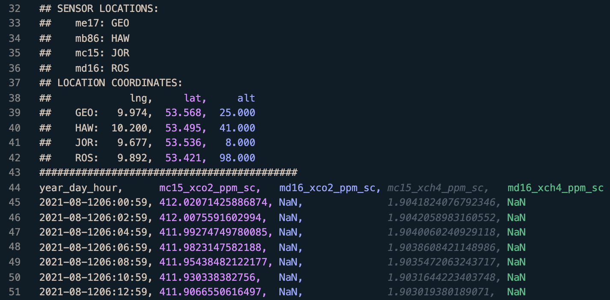

<!--
_class: invert
_backgroundImage: "url(images/dark-forest-bg.jpg)"
-->

# Workshop - Extract Retrieval Data

Moritz Makowski, moritz.makowski@tum.de

---

<!--
paginate: true
backgroundImage: "url(images/bright-forest-bg.jpg)"
footer: '**Extract Retrieval Data**'
-->

# Agenda

1. What is the goal of this "extraction"?
2. Where is this data being stored?
3. What happens during the filter process?
4. Background knowlegde when using software tools like this
5. How to use this tool
6. ~~What `calibrationDays` are & the complication with them~~
7. ~~How the automation works~~

---

<!--
footer: '**Extract Retrieval Data** - 1 - What is the goal of this "extraction"?'
-->

## 1. What is the goal of this "extraction"?

https://retrieval.esm.ei.tum.de/hamburg/2021-08-31

<!--
- Show retrieval plot
- Raw data is store in a database
- The filtered data is easier to use in models
-->

---

https://github.com/tum-esm/extract-retrieval-data/blob/main/docs/example-out.csv

---

<!--
footer: '**Extract Retrieval Data** - 2 - Where is this data being stored?'
-->

## 2. Where is this data being stored?

https://wiki.tum.de/display/esm/EM27+Retrievals

<!--
- MySQL database
- Raw data only
-->

---

<!--
footer: '**Extract Retrieval Data** - 3 - What happens during the filter process?'
-->

## 3. What happens during the filter process?

1. **Calibrate** the raw measurement data
2. Filter out data where **GFIT flagged** some anomaly
3. Filter out any data according to specific **filter cases**
4. Compute a **rolling mean** over the remaining data
5. **Resample** the smooth curves at a given rate

<!--
1. ... calibration factors are used from the database
2. ... (temperature in the enclosure, rapid concentration drop, etc.)
3. ... I will mention the filter cases in a minute
4. ...
5. ... for the output files (row)

Show retrieval page again.
-->

---

Tweakable filter settings:

-   `filter.movingWindowSizeMinutes`
-   `filter.outputStepSizeMinutes`
-   `filter.cases`

 

See Master Thesis of Nico Nachtigall (NAS: `/tuei/esm/Thesis/Masterarbeiten/2020 MA Nico Nachtigall/Nachtigall_MasterThesis_final.pdf`)

---

---

---

---

1. Terminology and Concepts: Git, GitHub, the Python Interpreter Virtual Python Environment, Dependencies

2. What this tool does: Where the data is coming from, what the filter/interpolation steps are, how the output CSVs look

3. How to use the tool: Where to find the code, how to configure it, how to run it
