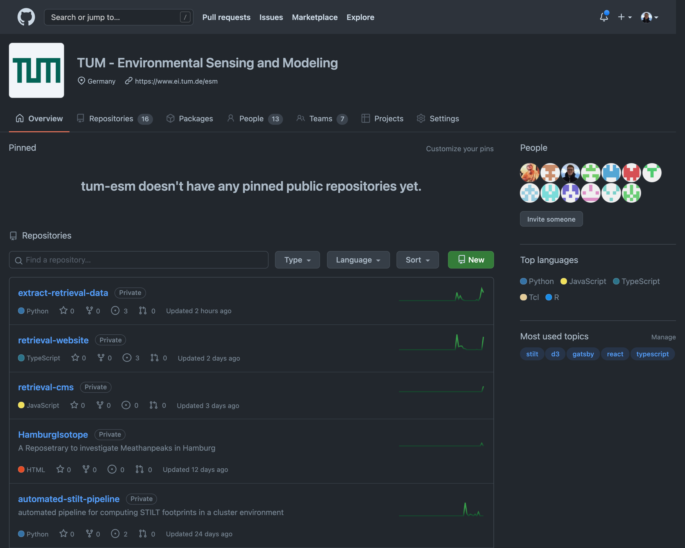

<style>
img[alt~="center"] {
  display: block;
  margin: 0 auto;
}
p[alt~="center"] {
  display: block;
  width: 100%;
  text-align: center;
}
* {
  font-family: "Rubik", sans-serif;
}
h1, h2, h3, h4, h5, h6 {
    color: #334155;
}
section {
    color: #0F172A;
}

a {
    color: #0369A1;
    text-decoration: underline;
}

section.invert footer, section.invert:after {
    color: #0F172A;
    opacity: 55%;
}

section.invert footer, section.invert:after {
    color: white;
    opacity: 70%;
}

s {
    opacity: 55%
}

section.invert {
    color: #E2E8F0;
}
section.invert h1 {
    color: #F1F5F9;
}
section.invert a{
    color: #7DD3FC;
    text-decoration: none;
}

strong {
    font-weight: 600
}
</style>

<!--
_class: invert
_backgroundImage: "url(images/dark-forest-bg.jpg)"
-->

# Overview - Extract Retrieval Data

Moritz Makowski, moritz.makowski@tum.de

---

<!--
paginate: true
backgroundImage: "url(images/bright-forest-bg.jpg)"
footer: '**Extract Retrieval Data**'
-->

# Agenda

1. What is the goal of this "extraction"?
2. What happens during the filter process?
3. Where is the novelty?
4. How to access this data?
5. Background knowledge for software tools like this
6. How to use this tool
7. ~~What `calibrationDays` are & the complication with them~~
8. ~~How the automation works~~

---

## 1. What is the goal of this "extraction"?

https://retrieval.esm.ei.tum.de/hamburg/2021-08-31

<!--
- Show retrieval plot
- Raw data is stored in a database
- The filtered data is easier to use in models
-->

---


https://github.com/tum-esm/extract-retrieval-data/blob/main/docs/example-out.csv

---

## 2. What happens during the filter process?

1. **Calibrate** the raw measurement data
2. Filter out data where **GFIT flagged** some anomaly
3. Filter out any data according to specific **filter cases**
4. Compute a **rolling mean** over the remaining data
5. **Resample** the smooth curves at a given rate

<!--

You can all reread this in the README.md

1. ... calibration factors are used from the database
2. ... (temperature in the enclosure, rapid concentration drop, etc.)
3. ... I will mention the filter cases in a minute
4. ...
5. ... for the output files (row)


Show retrieval page again.
-->

---

**Tweakable filter settings:**

-   `cases`
-   `movingWindowSizeMinutes`
-   `outputStepSizeMinutes`

<br/>

An explanation of the filter cases can be found in the master thesis of Nico Nachtigall (NAS: `/tuei/esm/Thesis/Masterarbeiten/2020 MA Nico Nachtigall/Nachtigall_MasterThesis_final.pdf`)

---

## 3. Where is the novelty?


---

**How it used to be:** https://gitlab.lrz.de/esm/columnmeasurementautomation

_(You should probably not try to understand this code)_

<br/>

**Problem:** One big pile of code that does everything: Triggering GFIT, loading data into the database, generating plots, generating CSV files, uploading data to the website.

<!--
- Plus: Everyone might want to use the data in a different way
-->

---

**Goal:** Split this pipeline into two independent processes!

<br/>

1. Fill the database with retrieval data
2. Use that database to generate certain output files

<br/>

**This project** should implement a convenient way for you to **generate output files** from that database.

<!--
- We handle the generation of retrieval data
- Current and future systems are being/should be built in a similar way
-->

---

## 4. How to access this data?

https://wiki.tum.de/display/esm/EM27+Retrievals

https://github.com/tum-esm/extract-retrieval-data

<!--
- MySQL database
- Raw data only
- extract-retrieval-data tool
-->

---

## 5. Background knowledge for software tools like this

---

-   Git (https://wiki.tum.de/display/esm/Version+Control+with+Git)

<!--

Switch to extract-retrieval-data in VSCode

-->

---

-   GitHub/GitLab (https://wiki.tum.de/display/esm/GitHub+and+GitLab)



<!--

Show issues on GitHub

-->

---

-   Python Interpreter & Dependencies (https://wiki.tum.de/display/esm/Python+Development)

## 

---

<br/>

-   Virtual Environments (https://wiki.tum.de/display/esm/Python+Development)

```bash
which python
# output: /usr/bin/python

source /Users/moritz/Documents/research/extract-retrieval-data/.venv/bin/activate

which python
# output: /Users/moritz/Documents/research/extract-retrieval-data/.venv/bin/python

deactivate

which python
# output: /usr/bin/python
```

\* UNIX commands\_

<!--

Show venv in VS Code

-->

---

## 6. How to use this tool

👉 Why this is not a workshop.

<br/>

See setup instructions in the `README.md` at https://github.com/tum-esm/extract-retrieval-data.

<!--

- University machines
- Different operating systems
- Different skill levels

-->

---

**`config.example.json`**: https://github.com/tum-esm/extract-retrieval-data/blob/main/config.example.json

**`example-out.csv`**: https://github.com/tum-esm/extract-retrieval-data/blob/main/docs/example-out.csv

---

<!--
_class: invert
_backgroundImage: "url(images/dark-forest-bg.jpg)"
_paginate: false
-->

# Overview - Extract Retrieval Data

Moritz Makowski, moritz.makowski@tum.de

---

## 7. What `calibrationDays` are & the complication with them

## 8. How the automation works
