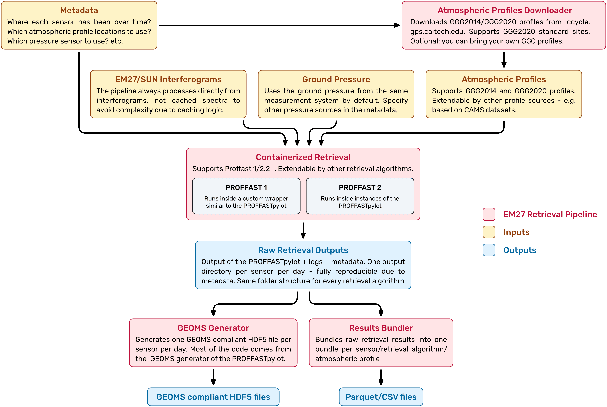
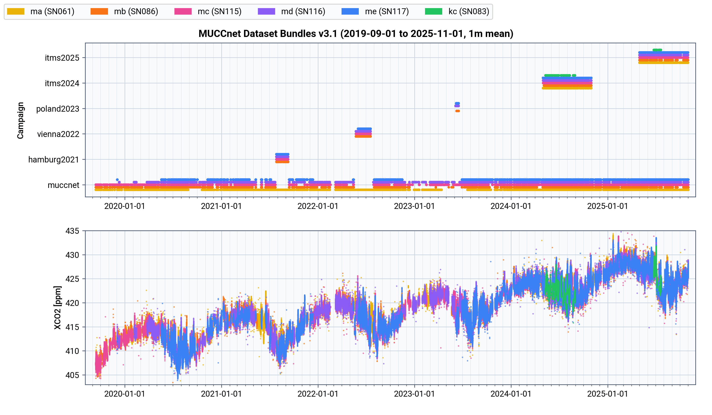

# Summary

The EM27/SUN [@Gisi2011;@Hase2016] is an FTIR spectrometer used to perform solar absorption measurements to derive column-averaged atmospheric concentrations of greenhouse gases (GHGs). In support of ESA, the COllaborative Carbon Column Observing Network (COCCON) [@Frey2019;@Alberti2021;@Herkommer2024] has been established to offer a framework for the operation and data analysis of the EM27/SUN, ensuring the generation of fiducial GHG observations. The process of estimating the column-averaged concentration of GHGs from the interferograms recorded by the EM27/SUN is called retrieval. The retrieval algorithm established in the COCCON community is PROFFAST [@Hase1999;@Sha2020;@Hase2023]. PROFFASTpylot [@Feld2024] is an interface around PROFFAST that significantly reduces the complexity of running PROFFAST retrievals.

{width="78%"}

\vspace{-2mm}

The Munich Urban Carbon Column network (MUCCnet) consists of 5 EM27/SUN spectrometers deployed in and around Munich, Germany [@Heinle2018;@Dietrich2021;@Aigner2023]. Due to its autonomous operation since 2019, our research group generates a significant amount of EM27/SUN data. Processing this data in an automated and scalable way required us to extend the functionality of the PROFFASTpylot. Under the hood, we use the PROFFASTpylot to ensure consistency with the COCCON community. The EM27 Retrieval Pipeline is complementary to the PROFFASTpylot, but the more EM27/SUN measurement data one has to retrieve, the more benefits come from this higher degree of automation. While not implementing 100% of the flexibility the PROFFASTpylot provides, this pipeline is flexible enough to be used by any EM27/SUN setup, adhering to the COCCON standards.

# Statement of Need

Human-induced climate change is one of the most pressing issues of our time, as it puts the stability of our Earth system at risk. Our civilization is built on that stability. Anthropogenic GHG emissions, as well as natural sources and sinks of GHGs, have to be quantified to create targeted reduction policies, measure policy effectiveness, and identify new emission sources [@Calvin2023].

The EM27/SUN is widely used to achieve these GHG flux estimations [@Hase2015;@Klappenbach2015;@Chen2016;@Butz2017;@Vogel2019;@Luther2019;@Dietrich2021;@Jones2021;@Luther2022;@Tu2022;@Forstmaier2023;@Doc2025journal;@Stauber2025]. Unlike the HR125 used by TCCON [@tccon], the EM27/SUN can be transported and deployed at different and remote locations without much effort. Since 2016, the instruments of our permanent urban sensor network MUCCnet have been deployed at 3 locations in San Francisco [@Klappenbach2021], 4 in Hamburg [@Forstmaier2023], 4 in Vienna [@Luther2023], 12 in Poland [@Luther2019;@Luther2022], and 11 locations in Munich [@Chen2018;@Dietrich2021].

\autoref{fig:data} shows the XCO2 timeseries of the MUCCnet instruments since September 2019. Running the retrievals for various instrument deployments and keeping track of all deployments over time requires an organizational system that this pipeline provides. To enable a large number of long-term observations with EM27/SUN spectrometers, such as the upcoming sensor networks of COCCON-Spain [@cocconspain] and GEMINI-UK [@geminiuk], an improvement in automation is crucial. The EM27 Retrieval Pipeline addresses this.

{width="100%"}

# Software Design

We made the following architectural decisions to achieve this higher degree of automation and ease of use:

- **Configuration:** JSON configuration files are used to specify input/output paths, retrieval algorithm, start/end dates, and so on. These files are validated against JSON schemas [@jsonschema;@pydantic] representing a strict set of rules for their structure and content. A misconfiguration will be detected at program start, instead of failing only when the code runs into an invalid configuration parameter. The JSON schema is rendered as an API reference in the documentation, enabling us to adequately document a large number of configuration parameters.
- **Metadata Management:** Metadata (where/when/how each sensor was set up) is provided as JSON files as well. These files can be stored locally or pulled from a GitHub repository, enabling centralized, version-controlled tracking of sensor deployments. Metadata systems used in different EM27/SUN teams can be easily translated into this pipeline's schema, which largely agrees with the schema proposed in @Zeeman2024.
- **Parallelization and Containerization:** While the PROFFASTpylot parallelizes the individual steps of PROFFAST, the pipeline parallelizes the whole retrieval process by running one isolated retrieval job per sensor per day. Every result folder maintains the structure of an individual PROFFASTpylot run, but also stores all configuration files required to reproduce the respective output folder.
- **Algorithm Support:** While each tagged release of the PROFFASTpylot supports a specific range of PROFFAST versions, the EM27 Retrieval Pipeline keeps support for all implemented retrieval algorithms and versions – the user has to specify which algorithm and version to use for a job. Furthermore, we added our own interface for PROFFAST 1 retrievals. The pipeline's architecture is independent of the underlying retrieval algorithm; hence, it could be extended to support GFIT [@Connor2016;@Zeng2021] or other algorithms.
- **Caching/Implicit Scheduling:** Users do not have to define an explicit queue of jobs, but instead define a date range and a list of sensors. The downloading/retrieval/bundling will decide which jobs to run, i.e., only run the jobs where no output exists yet.
- **Testing:** The codebase is statically typed and checked with strict MyPy [@mypy] and Pyright [@pyright], and includes unit- and end-to-end tests (using PyTest [@pytest]) covering all major functions and retrieval scenarios.

Furthermore, the pipeline adds features required to produce long-term EM27/SUN datasets:

- **A fully automated interface to obtain Ginput data:** It automates requests for atmospheric profiles in the GGG2014 or GGG2020 format from a Ginput server [@Laughner2021;@Laughner2023;@tcconwiki].
- **Bundling of retrieval results:** The raw retrieval outputs can be distributed over thousands of folders. The bundling routine merges these outputs into one file per sensor/retrieval algorithm/atmospheric profile, suitable for distribution.

\autoref{fig:architecture} shows the current building blocks of the EM27 Retrieval Pipeline. For the full feature set of the pipeline, please refer to its GitHub repository at [github.com/tum-esm/em27-retrieval-pipeline](https://github.com/tum-esm/em27-retrieval-pipeline) and documentation. For example, starting with version 1.8, the pipeline extracts important parameters from the given OPUS files using the OPUS-file reader of the `tum-esm-utils` library [@tumesmutils].

# Research Impact Statement

The pipeline was first established in 2021 [@Rimann2022] and has been used for our entire EM27/SUN dataset since 2022 [@Luther2023;@Klappenbach2024;@Chen2024;@Tang2024;@Loew2025;@Stauber2025;@Chen2025ICUC]. Multiple journal publications using MUCCnet for inverse modeling are currently in preparation. The data generated by MUCCnet and the EM27 Retrieval Pipeline has been published to the ICOS Carbon Portal [@Makowski2023CarbonPortal;@Makowski2024CarbonPortal] and the EVDC Portal [@Loew2025EVDC;@Chen2025EVDCOCOPF10;@Chen2025EVDCOCOPF22] and is a cruicial data input for the GHG modeling approaches developed with the grants listed below.

# Acknowledgement of Financial Support

This work is funded by the Horizon 2020 ICOS Cities PAUL Project under [grant no. 101037319](https://cordis.europa.eu/project/id/101037319), the German Federal Ministry of Education and Research (BMBF) project 'Integrated Greenhouse Gas Monitoring System for Germany' (ITMS) under [grant no. 01LK2303B](https://www.fona.de/en/measures/funding-measures/ITMS_en.php), and the ERC Consolidator Grant CoSense4Climate under [grant no. 101089203](https://cordis.europa.eu/project/id/101089203).

KIT acknowledges support by the ITMS grant for PROFFASTPylot development and maintenance, and support by ESA via the projects COCCON PROCEEDS (contract 4000121212/17/I-EF) and COCCON OPERA (contract 4000140431/23/I-DT-Ir) for COCCON code development and maintenance.

# References
